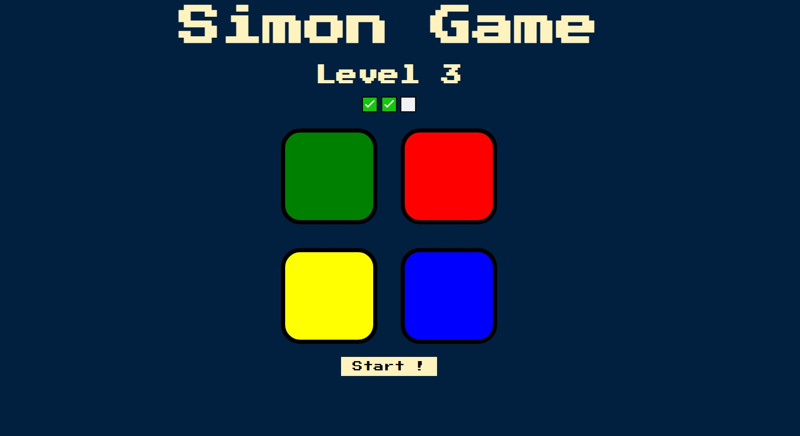

<h1 align="center">
🤖 Simon Game
</h1>
<p align="center">
HTML | CSS | JavaScript
</p>

> It is a short-term memory skill game.

## Live Demo
Play it [Here.](https://the-defaultcube.github.io/WEBD22_SimonGame/)

## About the Project
Originally created by Ralph H. Baer and Howard J. Morrison. It basically creates a series of tones and lights and requires a user to repeat the sequence. If the user succeeds, the series becomes progressively longer and more complex. Once the user fails or the time limit runs out, the game is over. 

## 🧩 Main Features
* Responsive UI - Support for both desktop and mobile devices. 
* UI animations making the gameplay more fun. 

## 💻 TechStack Used
* [HTML](https://www.w3schools.com/html/)
* [CSS](https://www.w3schools.com/css/)
* [JavaScript](https://developer.mozilla.org/en-US/docs/Learn/Getting_started_with_the_web/JavaScript_basics)
* [jQuerry](https://jquery.com/)

## Installation

1. Clone the repo
 ```terminal
 $ git clone https://github.com/The-DefaultCube/WEBD22_SimonGame/
 ```
2. Open `index.html` file.

## 🖼️ Screenshot


## 📩 Contact
- Contact me : manish0307kumar@gmail.com
- Project Link : https://github.com/The-DefaultCube/WEBD22_SimonGame/


## 🙏 Thanks :)
```js
if ( youLovedProject() ) {
 starIt();
}
```
